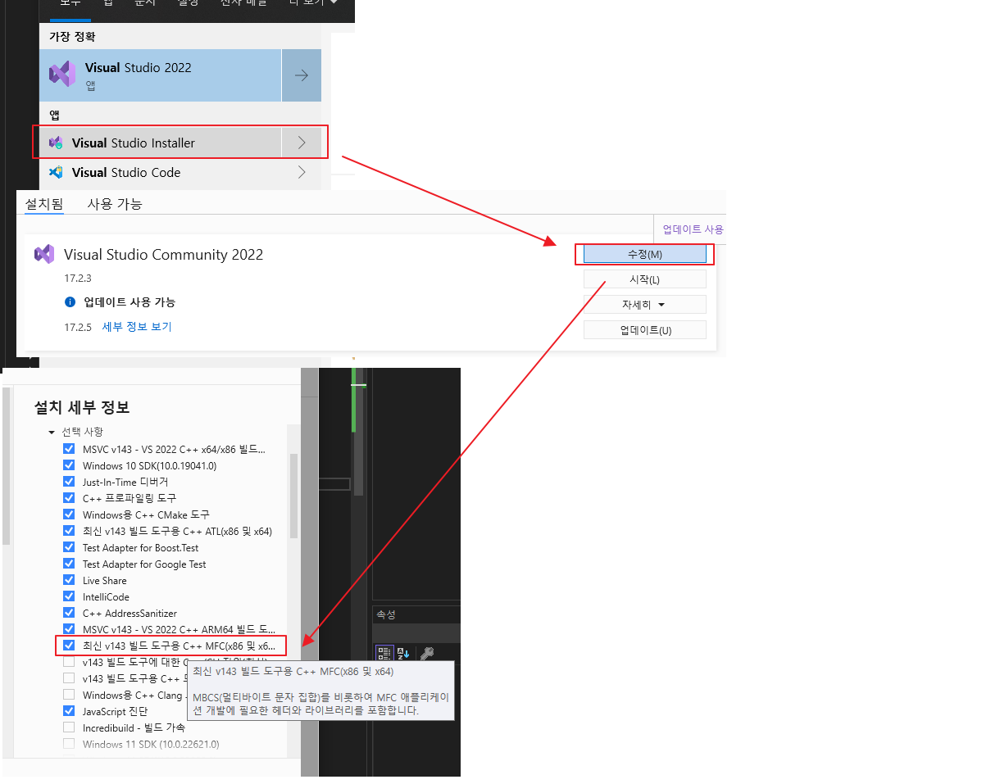

## Build & Execute OpenAPLR_Team4

### 1. Build Project

##### 1.1 Pre-Condition
(1) Copy "opencv" directory and all files in it to the root directory of "OpenAPLR_Team4" project.
  &nbsp;&nbsp; (You can find it from the original source codes (OpenAPLR-3.1.1_Vs2022/opencv))

(2) Install MFC to visual studio as below picture.

##### 1.2 Build

(1) Open "OpenALPR.sln" solution file with visual studio
(2) Make sure "Release/x64" is selected as a build configuration.
(3) Execute "solution build"

### 2. Execute Program

##### 2.1 Pre-Condition

(1) Execute "setup.bat"

 - "setup.bat" will move all files required to run, including key and cert to "x86/release".

(2) Check if all files described below exist normally.

- "x64/release" directory
  - configuration files : server-conf.json, client-conf.json
  - db data files : db/account.db, licenseplate.db, otpbase.db
  - "keys" directory
    - "ca" directory
      
      
      
    - "client" directory
      
      
      
    - "encKey" directory
      
      
      
    - "server" directory
      
      

##### 2.2 Run
- If you want to run server or client on other windows computer, 
    Copy "Release" in x64 directory directory to the target device.

###### 2.2.1 Run Server
- Execute "server.exe"(located in x64/Release) before running "lgofficer" as a client.

###### 2.2.1 Run Client
(1) Execute lgofficer
  - If the client and server are running on different devices, 
     ① check ip address of server.  
     ② open x64/Release/client-conf.json then modify server_ip.
  - Run " lgofficer.exe" as a client.

(2) Execute OTPGen Application (See the "OTPGen" directory)
 - Let's try User #6 (one of several users in the account database) in this guide.
 - Run "OTPGen_SecurityPolice_006.exe" and you can see  the otp number and it ill be changed periodically.

(3) Pass Log-in information on the "lgofficer" application.
 - For blank text box, fill in like below.
  ID : SecurityPolice_006
  PW : !dlwormsS4Best
  OTP : Check the number in the OTP program that has already been run.
   

(4) Start process
- If user authentication is succeeded, Start button will be enabled like below.
- Push the "Start" button.
